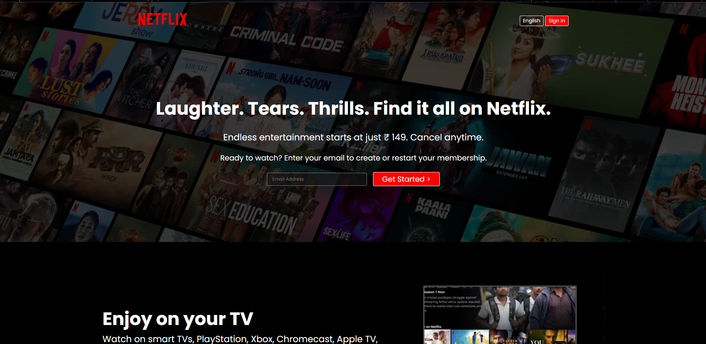

# Netflix Clone

[Live Demo](link_to_live_demo)



This project is a Netflix clone created as part of [describe_the_purpose_or_learning_goal_of_the_project].

## Table of Contents

- [Description](#description)
- [Features](#features)
- [Technologies Used](#technologies-used)
- [Installation](#installation)
- [Usage](#usage)
- [Contributing](#contributing)
- [License](#license)

## Description

The Netflix Clone project is aimed at recreating the front-end of the popular streaming platform Netflix. This project was built to enhance skills in [mention_the_technologies_or_frameworks_used], providing a similar user experience to the actual Netflix website.

## Features

- User authentication and login functionality
- Browse movies and TV shows
- Watch trailers and previews
- Add movies to watchlist
- Responsive design for various devices

## Technologies Used

- HTML5 & CSS3
- JavaScript (React, Node.js, etc.)
- [Other technologies used in the project]

## Installation

1. Clone the repository:
   ```bash
   git clone https://github.com/your_username/netflix-clone.git
